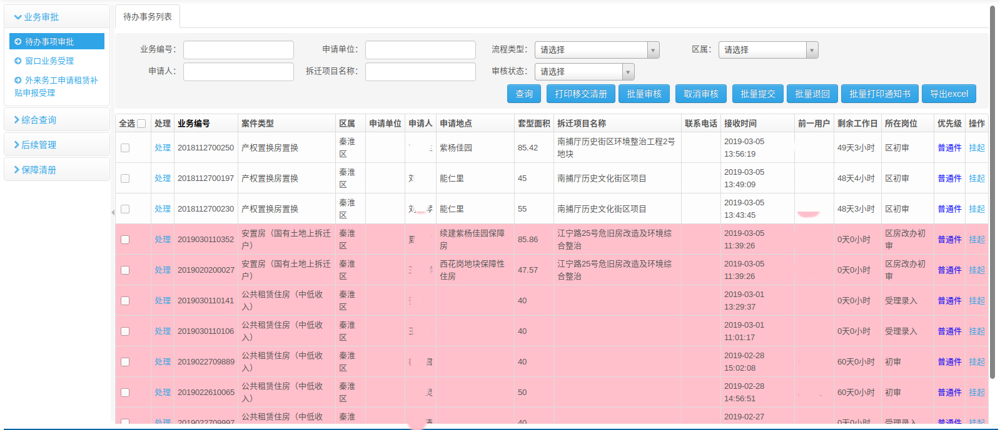
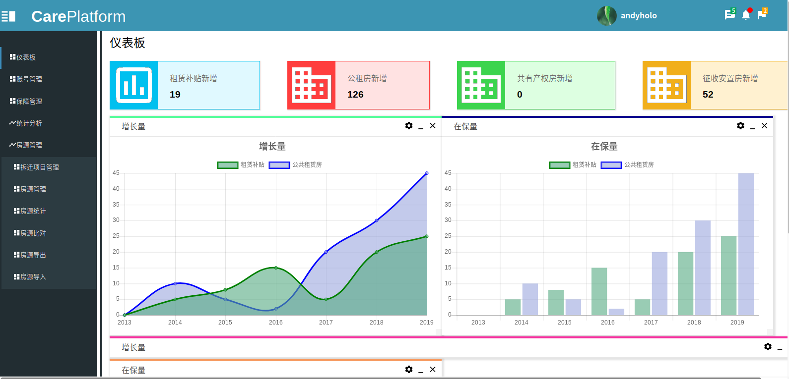
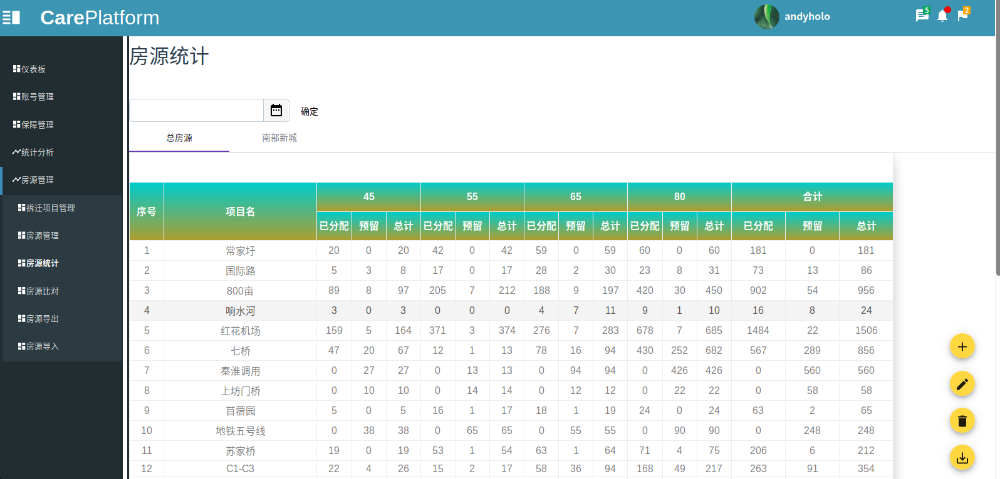
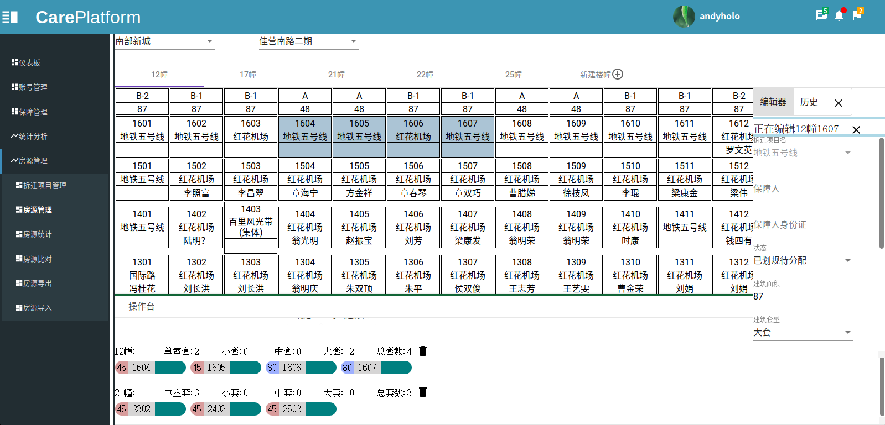

# 个人信息

 - 唐俊安/男/1993 
 - 本科/南京大学金陵学院-计算机科学与技术 
 - 工作年限：3年
 - 期望职位：java或web
 - TEL. 17368122570
 - Email tangjunanskd@hotmail.com

 # 自我介绍
    热爱技术的自我驱动型开发者，拥抱变化。自学能力强能够熟练阅读英文文档。

# 项目经历
## 电子商务导购网站制作
一个交互式店铺展示使用bootstrap作为页面框架，Jquery交互。

## 秦淮区房改办内网在线台账系统
在线OA系统，用于业务上下极之前的业务审批、保障审批、保障记录等，本人具体负责系统的待办事项、流程处理和申请表单模块
### 技术栈
- jsp freemarker

## 秦淮区房改办房源管理系统
完全由本人开发的在线房源管理系统，用于秦淮区征收安置房源的管理、统计等，极大的提高了房源管理的效率。（项目部署在自己购买的云服务器上，可随时演示）
### 技术栈
- Angular/RxJS
- Spring boot/Hibernate/PostgreSql
- Apache/Docker

**仪表板**

**房源统计**

 **房源分配及管理**

# 工作经历

## 秦淮区住房制度改革办公室 （ 2016年8月 ~ 至今 ）

- 对内网在线台账系统进行维护（JSP、mysql、tomcat）
- 对内网系统的使用进行培训
- 自行开发了房源管理系统（前端使用angular，后端使用spring boot、postgresql和hibernate）目前已上线并运行良好，大大提高了房源分配和管理效率
- 后台数据维护
  
## 南京水平方商管公司 （ 2015年12月 ~ 2016年7月 ）
- 电子商务网页制作(bootstrap、jquery)
- 电子门户网页维护
- 后台数据维护

# 技能

- Web开发：Html css javascript typescript scss RxJS
- Web框架：Angular Reactjs
- 后台开发: Java Springboot Hibernate Vert.x NodeJS
- 数据库相关：Postgresql Mysql
- 运维技术: ubuntu Docker kvm
- 机器学习: 监督学习 无监督学习 聚类等